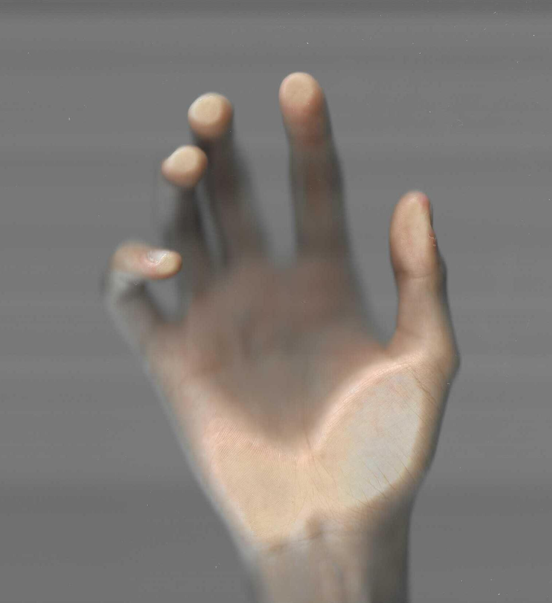
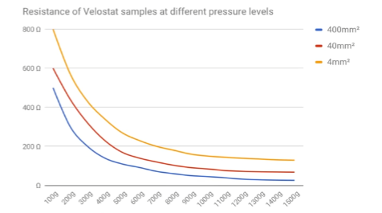

**Total time taken for all journeys: 6h**

# June 7th: Introduction & Research information for the project

Before I begin writing about this journey, I would like to first write about why I started this project.

I normally use Surface Pro 8, and I always carry it with the charger and mouse in my laptop bag.

But whenever I put these necessities in along with my laptop, the bag always looks bulgy and becomes VERY VERY uncomfortable to put in my backpack.


[Pic1] very uncomfortable looking bag

I've been thinking about solving this problem for a while now, and the idea was to make it easier to store the mouse (which seemed to take up the most space).
(There was also a way to use a flat mouse, but I gave up after reading an article that said it was bad for wrist health.)

First, I thought of a trackpad as a way to reduce the size of these mice.
Trackpads are flat and are built into most laptops (and mine were).
However, the trackpad was too foreign to me, who mainly used a mouse, because it was different from the general mouse experience, and it was also too uncomfortable and slow for general office work.

So, as I was researching these solutions, I came across a device made by Apple.


[Pic2] Apple Magic Trackpad(USB‑C)

However, in the case of this device, it doesn't seem to suit me because the usage is similar to that of a trackpad rather than a mouse.

After investigating several devices and not finding a suitable solution, I came up with an idea for a device with the following features:

1. Similar in size to a mouse pad
2. The user places his or her hand on the device as if he or she were holding a normal mouse
3. When the user moves his or her hand on the device, the mouse pointer moves to match the hand he or she moves
4. The user controls the mouse by clicking or scrolling the device as if he or she were using a mouse

There was something important I had to think about in order to create this device.

**How ​​to detect hand movements?**
**How ​​to detect events such as presses?**

These were the biggest problems.
The distance sensor could not recognize finger clicks, etc., and the camera was even more incapable.
To solve this problem, I first went back to the idea of ​​the trackpad. This is because the trackpad ultimately detects the point of pressing.
I also checked the detection principle of the trackpad as a capacitive touch, and I also looked into Force Touch developed by Apple.


[Pic3] Apple Force Touch

This seemed possible using related technology, as unlike a typical trackpad, it also allowed for analog recognition of pressure.

However, I thought that since that technology only has pressure sensors at the four corners of the top, bottom, left, and right, the recognition of the press may be inaccurate if I put my entire hand on it.


[Pic4] A scan of ,my right hand

If I actually put my hand on the device, it should recognize only the pressed part and recognize the drag of the pressed part, so I was wondering how to do this.

Then I saw the following YouTube video.

[](https://www.youtube.com/watch?v=vab-Nig9MXc)
[Vid1] https://www.youtube.com/watch?v=vab-Nig9MXc

This video shows the pressure sensors arranged in a matrix and then pressed by hand.
I saw this and thought it was great because even if I get it in low quality using the pressure sensor, I only need to detect the pressing anyway.

So I looked for related videos after that.<br>
https://www.youtube.com/watch?v=SLRYX879Py0<br>
https://www.youtube.com/watch?v=4JBSHqUcaG4<br>
https://www.youtube.com/watch?v=0uPZwMg5B3k

After checking all of these, I got a rough idea of ​​the pressure sensor structure and subsequent design, and concluded that it would be something to use.

However, after thinking about it carefully, this thought also occurred to me.

"After all, the recognition quality of the pressure sensor is not very fine, so wouldn't it be difficult to recognize the movement of the hand in a fine manner?"

So I thought it would be difficult to use only the pressure sensor, so I decided to arrange the capacitive sensor in a matrix together with the pressure sensor. So the initial circuit design that I came up with is as follows.


[Pic5] Idea sketch

**Total time spent: 6h**

# June 8th: Calculating required settings and designing the circuit

It's 5:30am.

Anyway, before designing, I decided to use Velostat as the pressure sensor last time, so I decided to calculate how much force can be recognized when using this Velostat.

Since I had to calculate it by considering the user's palm pressure and finger click pressure, I first looked up the grams required for a typical mouse click.

Most mouses have a recognition value of 50gF, so I used this value as a reference.
Based on the weight of a typical human hand, the pressure generated when placing it on the device was calculated to be around 400gF.

So I assumed the ideal pressure recognition range to be 0gF ~ 600gF.

To calculate the pressure, I first looked for the thickness of the Velostat that can be purchased. (Ultimately, the resistance according to the degree of pressing varies depending on the thickness, so I used the thickness as the standard.)

```plain
Film Thickness for 1704: 4.0 mil (102 microns)
Film Thickness for 1706: 6.0 mil (152.4 microns)
```

When I looked at the thickness of the Velostats that are commonly sold, I chose a Velostat with a thickness of 4.0 mil (I thought I could control it in more detail later).

So I decided to use a Velostat with a thickness of 4.0 mil, and based on that, I investigated the resistance value.


[Pic1] Resistance of Velostat samples at different pressure levels

Next, I considered the size of the device.

Since I was planning to make the device the size of a mouse pad, I decided to make the touch part of the device similar in size to Small (260mm x 215mm) considering the size of a typical mouse pad.


[Pic2] Mouse Pad Sizes

**Total time spent: 7.5h**